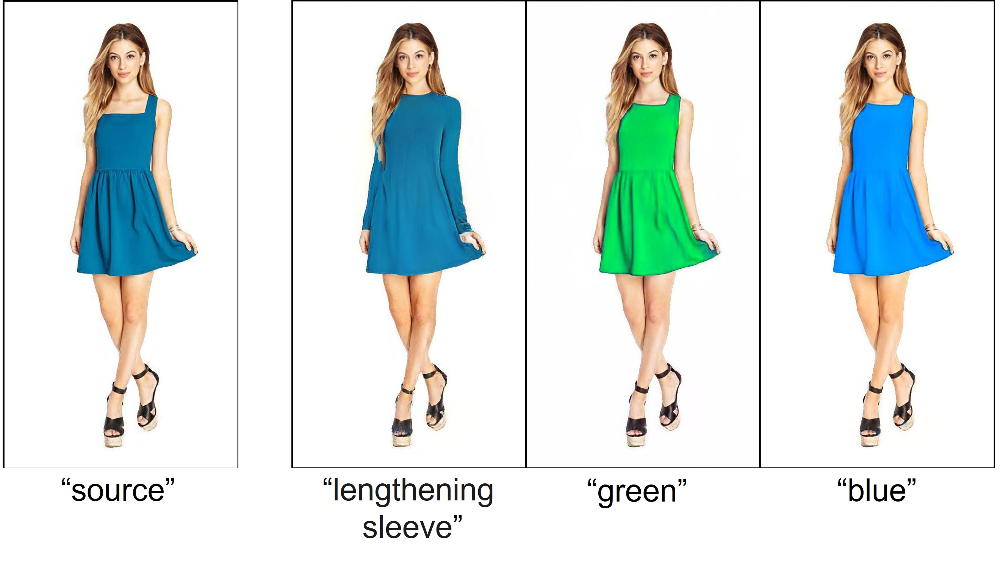

# TD-GEM: Text-Driven Garment Editing Mapper


# Updates
The [code](https://github.com/resa-git/TDGEM) is available at github

# Getting Started

# Setup docker 
### Linux system
Go to the Docker folder, 
`docker build -t dockerUserName/styleclip:latest .` <br/>

on linux system write <br/>
`sudo docker run  --rm -it -p 8888:8888  --gpus all -v "$(pwd)"/TDGEM_project:/home/jovyan/work dockerUserName/styleclip:latest /bin/bash` <br/>
You can drop `dockerUserName/` if you create a local image
# GAN Inversion
First, please download the PTI weights: [e4e_w+.pt](https://drive.google.com/file/d/1NUfSJqLhsrU7c9PwAtlZ9xtrxhzS_6tu/view?usp=sharing) into /pti/.

You can change the following paramters:

/pti/pti_configs/hyperparameters.py:
first_inv_type = 'w+' -> Use pretrained e4e encoder
/pti/pti_configs/paths_config.py:
input_data_path: path of real images
e4e: path of e4e_w+.pt
stylegan2_ada_shhq: pretrained stylegan2-ada model for SHHQ
```sh
python run_pti.py
```

The following models are required in the "styleGAN-Human/pretrained_models" folder:
* deeplabv3plus-xception-vocNov14_20-51-38_epoch-89.pth
* model_VSECRWKQFQTY_multi_id.pkl
* model_VSECRWKQFQTY_multi_id.pth  stylegan_human_v2_1024.pth

Please download them from [styleGAN-Human/pretrained](https://kth-my.sharepoint.com/personal/sanazsab_ug_kth_se/_layouts/15/onedrive.aspx?id=%2Fpersonal%2Fsanazsab%5Fug%5Fkth%5Fse%2FDocuments%2FPre%2Dtrained%20Model&ga=1)

# Local Optimizer
Go to the folder `OP`  
The `opt_clip_delta.py` is used to perform image manipulation for an individual file!  
 
 
```bash
 python opt_clip_delta.py --image_path "/home/jovyan/work/dataset/ds_200" --base_path "/home/jovyan/work/styleGAN-Human/outputs/ds_200" --results_dir "/home/jovyan/work/results/Op" 
```
 
The `run_op_edit.py` is a wrapper to run `opt_clip_delta.py` for a folder of images
 
```bash
 python run_op_edit.py
```

# StyleCLIP
Go to
```sh
cd /home/jovyan/work/StyleClip/StyleCLIP
```
 The train and test options are located at /mapper2/options as train_options.py and test_options.py files
 To run the StyleCLIP please edit the aformentioned files or use the proper arguments. 
 Run the styleCLIP as
```sh
python mapper2/scripts/train.py
```
The results folder can be given as an arguement `--exp_dir path_to_result`


The following model are required in the "pretrained_models" folder:
* model_ir_se50.pth
* stylegan2_1024.pth
* stylegan2-ffhq-config-f.pt
* stylegan_human_v2_1024.pth

Please download them from [Styleclip/pretrained](https://kth-my.sharepoint.com/personal/sanazsab_ug_kth_se/_layouts/15/onedrive.aspx?id=%2Fpersonal%2Fsanazsab%5Fug%5Fkth%5Fse%2FDocuments%2FPre%2Dtrained%20Model&ga=1)

# TDGEM
 Go to
```sh
cd /home/jovyan/work/TDGEM-main
```
 The train and test options are located at /mapper2/options as train_options.py and test_options.py files
 To run the TDGEM-main training please edit the aformentioned files or use the proper arguments. 
 Run the TDGEM-main training as
```sh
python mapper2/scripts/train.py
```
and 
inference as
```sh
python mapper2/scripts/inference.py
```
The results folder can be given as an arguement `--exp_dir path_to_result`


The following model are required in the "pretrained_models" folder:
* deeplabv3plus-xception-vocNov14_20-51-38_epoch-89.pth
* parsenet.pth
* stylegan2_1024.pth

Please download them from [TDGEM/pretrained](https://kth-my.sharepoint.com/personal/sanazsab_ug_kth_se/_layouts/15/onedrive.aspx?id=%2Fpersonal%2Fsanazsab%5Fug%5Fkth%5Fse%2FDocuments%2FPre%2Dtrained%20Model&ga=1)

